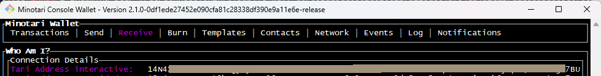
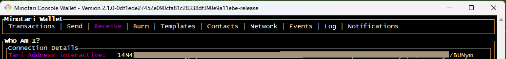

# Start the console wallet

## Starting the wallet

Create a new Linux window and start the console wallet:

```console
./minotari_console_wallet -b ./tari-mainnet-data \
    --network mainnet
```

```console
Initializing logging according to "/root/.tari/mainnet/config/wallet/log4rs.yml"
Node config does not exist.
Would you like to mine (Y/n)?
NOTE: this will enable additional gRPC methods that could be used to monitor and submit blocks from this node.
```

If you're asked "Would you like to mine", answer "Y"

Then you'll see:

```console
⠀⠀⠀⠀⠀⣠⣶⣿⣿⣿⣿⣶⣦⣀
⠀⢀⣤⣾⣿⡿⠋⠀⠀⠀⠀⠉⠛⠿⣿⣿⣶⣤⣀⠀⠀⠀⠀⠀⠀⢰⣿⣾⣾⣾⣾⣾⣾⣾⣾⣾⣿⠀⠀⠀⣾⣾⣾⡀⠀⠀⠀⠀⢰⣾⣾⣾⣾⣿⣶⣶⡀⠀⠀⠀⢸⣾⣿⠀
⠀⣿⣿⣿⣿⣿⣶⣶⣤⣄⡀⠀⠀⠀⠀⠀⠉⠛⣿⣿⠀⠀⠀⠀⠀⠈⠉⠉⠉⠉⣿⣿⡏⠉⠉⠉⠉⠀⠀⣰⣿⣿⣿⣿⠀⠀⠀⠀⢸⣿⣿⠉⠉⠉⠛⣿⣿⡆⠀⠀⢸⣿⣿⠀
⠀⣿⣿⠀⠀⠀⠈⠙⣿⡿⠿⣿⣿⣿⣶⣶⣤⣤⣿⣿⠀⠀⠀⠀⠀⠀⠀⠀⠀⠀⣿⣿⡇⠀⠀⠀⠀⠀⢠⣿⣿⠃⣿⣿⣷⠀⠀⠀⢸⣿⣿⣀⣀⣀⣴⣿⣿⠃⠀⠀⢸⣿⣿⠀
⠀⣿⣿⣤⠀⠀⠀⢸⣿⡟⠀⠀⠀⠀⠀⠉⣽⣿⣿⠟⠀⠀⠀⠀⠀⠀⠀⠀⠀⠀⣿⣿⡇⠀⠀⠀⠀⠀⣿⣿⣿⣤⣬⣿⣿⣆⠀⠀⢸⣿⣿⣿⣿⣿⡿⠟⠉⠀⠀⠀⢸⣿⣿⠀
⠀⠀⠙⣿⣿⣤⠀⢸⣿⡟⠀⠀⠀⣠⣾⣿⡿⠋⠀⠀⠀⠀⠀⠀⠀⠀⠀⠀⠀⠀⣿⣿⡇⠀⠀⠀⠀⣾⣿⣿⠿⠿⠿⢿⣿⣿⡀⠀⢸⣿⣿⠙⣿⣿⣿⣄⠀⠀⠀⠀⢸⣿⣿⠀
⠀⠀⠀⠀⠙⣿⣿⣼⣿⡟⣀⣶⣿⡿⠋⠀⠀⠀⠀⠀⠀⠀⠀⠀⠀⠀⠀⠀⠀⠀⣿⣿⡇⠀⠀⠀⣰⣿⣿⠃⠀⠀⠀⠀⣿⣿⣿⠀⢸⣿⣿⠀⠀⠙⣿⣿⣷⣄⠀⠀⢸⣿⣿⠀
⠀⠀⠀⠀⠀⠀⠙⣿⣿⣿⣿⠛⠀
⠀⠀⠀⠀⠀⠀⠀⠀⠙⠁⠀
Console Wallet

1. Create a new wallet.
2. Recover wallet from seed words or hardware device.
3. Create a read-only wallet using a view key.
>>
```

Create a new wallet by entering "1". You'll then be asked to enter, and then confirm, your wallet passphrase.

The next question is:

```console
Would you like to use a connected hardware wallet? (Supported types: Ledger) (Y/n)
```

We're choosing no, so we enter "n" here.

You are then asked to copy your seed words and type the word "confirm" to confirm that, yes,
you are never going to be shown these seed words again. Copy those seed words safely!

## Getting the wallet address

You locate the address in the console wallet as follows:

1. Use the left or right arrrow to move to the "Receive" tab
2. Copy the address in the "Tari Address interactive"  field

Save this address as you'll need it for both the minotari_miner and glytex

**NOTE**

It is very easy to copy only part of the address. In my setup, (which uses git bash), the default window width 
is just a bit narrower than the console wallet window and as a result the wallet looks like this



If you copy the address in the "Tari Address interactive"  field you'll get a truncated value.

So first make sure that the window is wide enough to include the full width of the "Connection Details" 
pane before copying the address. Make sure you see whitespace at the end of the addresses.




[Return to the main README](README.md)
